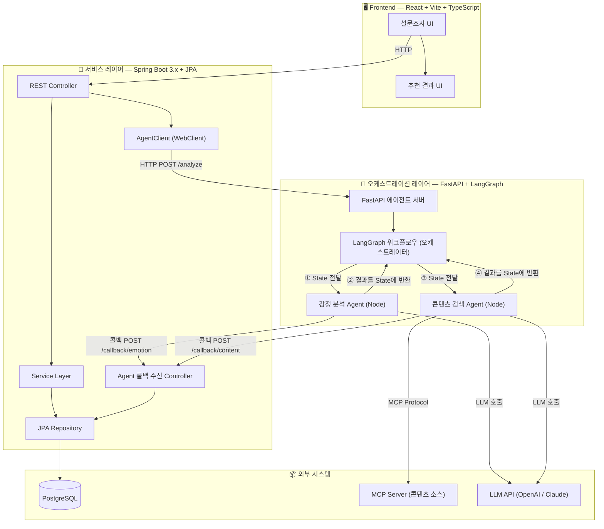
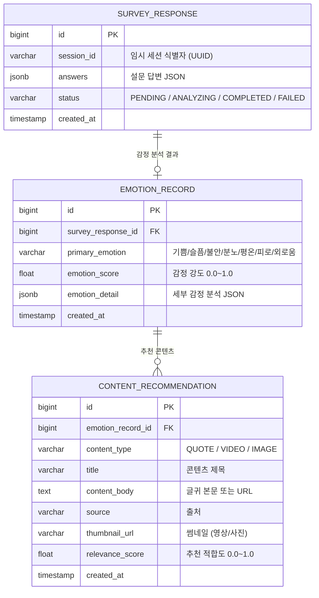
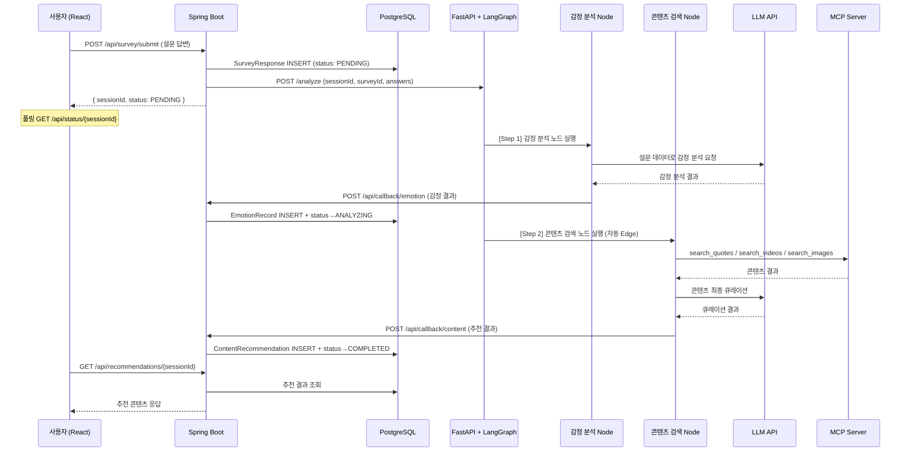
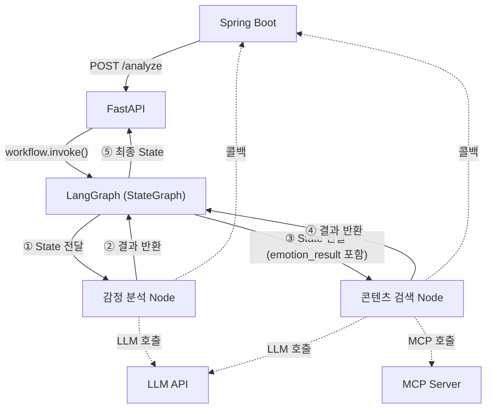
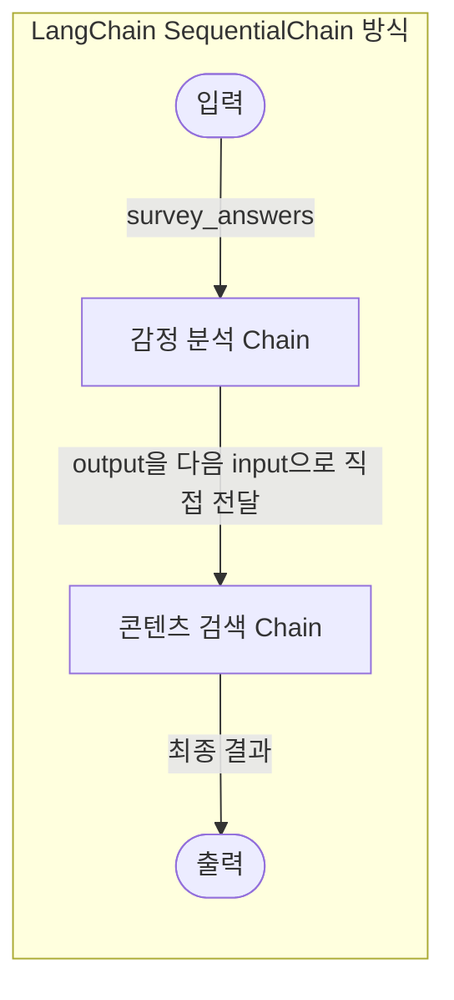
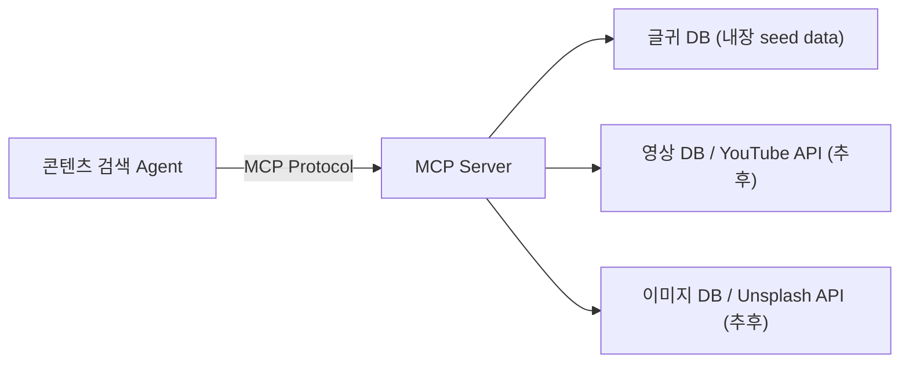

# 감정 기반 콘텐츠 추천 웹 서비스 — 단계별 설계서

감정 상태 설문조사를 통해 사용자의 감정을 분석하고, 멀티 에이전트 기반으로 맞춤 콘텐츠(글귀, 영상, 사진)를 추천하는 웹 서비스의 **전체 설계 문서**입니다.

> [!WARNING]
> **1차 개발 범위 제외 항목**: 로그인 기능(이름, 성별, 나이, 직업)과 기간별 감정 추이 관리 기능(그래프)은 **추후 개발 예정**입니다.

---

## 1. 전체 아키텍처



### 핵심 설계 원칙

| 원칙 | 설명 |
|------|------|
| **상태/DB는 Spring Boot만** | FastAPI/Agent는 **계산만** 수행. 모든 상태와 DB 트랜잭션은 Spring Boot가 관리 |
| **콜백 패턴** | Agent가 단계 완료 시 Spring Boot에 HTTP 콜백으로 결과 전송 |
| **Agent DB 무접근** | Agent 레이어는 DB에 직접 접근하지 않음 |
| **Graph = Supervisor** | LangGraph 그래프의 Edge 연결이 곧 오케스트레이션. 별도 Supervisor Agent 불필요 |

> [!NOTE]
> 현재 흐름은 "감정 분석 → 콘텐츠 검색"으로 고정적이므로 LangGraph 그래프 구조 자체가 Supervisor 역할을 수행합니다. 추후 동적 라우팅이 필요하면 `conditional_edge`로 확장 가능합니다.

---

## 2. 기술 스택 상세

| 계층 | 기술 | 비고 |
|------|------|------|
| **프론트엔드** | **React 18 + Vite + TypeScript** | 빠른 HMR, 타입 안전성, 풍부한 생태계 |
| **스타일링** | Vanilla CSS (CSS Variables) | 감성적 UI에 적합한 커스텀 디자인 |
| **차트 (추후)** | Recharts | 감정 추이 그래프용 |
| **서비스 레이어** | Spring Boot 3.x + JPA | REST API, 상태/DB 관리 |
| **빌드 도구** | Gradle (Kotlin DSL) | Spring Boot 빌드 |
| **에이전트** | FastAPI + LangGraph + LangChain | 멀티 에이전트 오케스트레이션 |
| **파이썬 환경** | Miniconda | 가상환경 관리 |
| **DB** | PostgreSQL | 설문, 감정 기록, 콘텐츠 저장 |
| **LLM** | OpenAI GPT-4o / Claude (선택) | 감정 분석 및 추천 |
| **콘텐츠 소스** | MCP Server | 글귀/영상/사진 검색 |

> [!TIP]
> **프론트엔드 추천 이유**: React + Vite + TypeScript는 빠른 개발 속도, Spring Boot와의 궁합, 감정 설문에 필요한 애니메이션(Framer Motion) 및 차트(Recharts) 지원이 우수합니다.

---

## 3. 프로젝트 디렉토리 구조

```
Emotion_Test_ANTI/
├── frontend/                            # React + Vite + TypeScript
│   ├── src/
│   │   ├── components/
│   │   │   ├── Survey/                  # 설문조사 컴포넌트
│   │   │   │   ├── SurveyStep.tsx       # 개별 문항 스텝
│   │   │   │   ├── EmojiSelector.tsx    # 이모지 선택기
│   │   │   │   ├── SliderInput.tsx      # 슬라이더 입력
│   │   │   │   └── ProgressBar.tsx      # 진행률 바
│   │   │   ├── Result/                  # 결과 표시 컴포넌트
│   │   │   │   ├── EmotionCard.tsx      # 감정 분석 카드
│   │   │   │   ├── ContentTabs.tsx      # 콘텐츠 탭 (글귀/영상/사진)
│   │   │   │   ├── QuoteCard.tsx        # 글귀 카드
│   │   │   │   ├── VideoCard.tsx        # 영상 카드
│   │   │   │   └── ImageCard.tsx        # 사진 카드
│   │   │   └── common/                  # 공통 UI 컴포넌트
│   │   │       ├── LoadingSpinner.tsx   # 분석 중 로딩
│   │   │       └── Layout.tsx           # 레이아웃
│   │   ├── pages/
│   │   │   ├── SurveyPage.tsx           # 설문 페이지
│   │   │   └── ResultPage.tsx           # 추천 결과 페이지
│   │   ├── api/
│   │   │   └── emotionApi.ts            # Spring Boot API 호출 모듈
│   │   ├── types/
│   │   │   └── index.ts                 # TypeScript 타입 정의
│   │   ├── App.tsx
│   │   └── index.css                    # 글로벌 스타일 (CSS Variables)
│   ├── package.json
│   └── vite.config.ts
│
├── backend/                              # Spring Boot 3.x
│   ├── src/main/java/com/emotion/
│   │   ├── controller/
│   │   │   ├── SurveyController.java     # 설문 API
│   │   │   ├── ContentController.java    # 추천 결과 API
│   │   │   └── AgentCallbackController.java  # Agent 콜백 수신
│   │   ├── service/
│   │   │   ├── SurveyService.java        # 설문 비즈니스 로직
│   │   │   ├── EmotionService.java       # 감정 결과 관리
│   │   │   ├── ContentService.java       # 콘텐츠 추천 관리
│   │   │   └── AgentClient.java          # FastAPI 호출 (WebClient)
│   │   ├── entity/                       # JPA 엔티티
│   │   │   ├── SurveyResponse.java
│   │   │   ├── EmotionRecord.java
│   │   │   └── ContentRecommendation.java
│   │   ├── repository/                   # JPA Repository
│   │   │   ├── SurveyResponseRepository.java
│   │   │   ├── EmotionRecordRepository.java
│   │   │   └── ContentRecommendationRepository.java
│   │   ├── dto/                          # DTO
│   │   │   ├── SurveyRequestDto.java
│   │   │   ├── EmotionResultDto.java
│   │   │   ├── ContentRecommendationDto.java
│   │   │   └── AgentCallbackDto.java
│   │   └── config/
│   │       ├── WebClientConfig.java      # WebClient 빈 설정
│   │       └── CorsConfig.java           # CORS 설정
│   ├── src/main/resources/
│   │   └── application.yml
│   └── build.gradle.kts
│
├── agent/                                # FastAPI + LangGraph (Miniconda)
│   ├── app/
│   │   ├── main.py                       # FastAPI 엔트리포인트
│   │   ├── config.py                     # 환경 설정 (LLM 키, 콜백 URL 등)
│   │   ├── api/
│   │   │   └── routes.py                 # API 라우터
│   │   ├── graph/
│   │   │   ├── state.py                  # LangGraph 상태 정의
│   │   │   ├── workflow.py               # LangGraph 워크플로우 정의
│   │   │   └── nodes.py                  # 그래프 노드 함수
│   │   ├── agents/
│   │   │   ├── emotion_analyzer.py       # 감정 분석 Agent
│   │   │   └── content_searcher.py       # 콘텐츠 검색 Agent
│   │   ├── tools/
│   │   │   ├── spring_callback.py        # Spring Boot 콜백 Tool
│   │   │   └── mcp_client.py             # MCP 서버 클라이언트 Tool
│   │   ├── prompts/
│   │   │   ├── emotion_prompt.py         # 감정 분석 프롬프트
│   │   │   └── recommend_prompt.py       # 추천 프롬프트
│   │   └── models/
│   │       └── schemas.py                # Pydantic 스키마
│   ├── environment.yml                   # Miniconda 환경 파일
│   └── requirements.txt
│
├── mcp-server/                           # MCP 콘텐츠 서버
│   ├── server.py                         # MCP 서버 메인
│   └── providers/
│       ├── quotes.py                     # 글귀 제공
│       ├── videos.py                     # 영상 제공
│       └── images.py                     # 이미지 제공
│
└── docker-compose.yml                    # PostgreSQL 인프라
```

---

## 4. 데이터 모델 (ERD)



### 주요 관계
- **SURVEY_RESPONSE ↔ EMOTION_RECORD**: 1:1 — 하나의 설문에 하나의 감정 분석 결과
- **EMOTION_RECORD ↔ CONTENT_RECOMMENDATION**: 1:N — 하나의 감정에 여러 콘텐츠 추천

---

## 5. 설문조사 설계

### 5.1 감정 카테고리

| 감정 | 영문 | 이모지 | 색상 테마 |
|------|------|--------|-----------|
| 기쁨 | Joy | 😊 | `#FFD700` |
| 슬픔 | Sadness | 😢 | `#4682B4` |
| 불안 | Anxiety | 😰 | `#9370DB` |
| 분노 | Anger | 😡 | `#DC143C` |
| 평온 | Calm | 😌 | `#3CB371` |
| 피로 | Fatigue | 😩 | `#808080` |
| 외로움 | Loneliness | 🥺 | `#6A5ACD` |

### 5.2 설문 문항 구성 (7문항)

| # | 질문 | 응답 유형 | 비고 |
|---|------|-----------|------|
| 1 | 지금 기분을 이모지로 표현하면? | 이모지 선택 (😊😢😡😰😌😩🥺) | 단일 선택 |
| 2 | 오늘 에너지 레벨은? | 슬라이더 (1~10) | |
| 3 | 가장 크게 느끼는 감정은? | 단일 선택 (기쁨/슬픔/분노/불안/평온/피로/외로움) | |
| 4 | 그 감정의 강도는? | 슬라이더 (1~10) | |
| 5 | 최근 스트레스 원인은? | 다중 선택 (일/관계/건강/재정/기타) | 복수 선택 |
| 6 | 원하는 위안의 형태는? | 단일 선택 (따뜻한 말/활력/평온/재미/위로) | |
| 7 | 추가로 표현하고 싶은 감정이 있나요? | 자유 텍스트 | 선택, LLM 분석 활용 |

---

## 6. API 명세

### 6.1 프론트엔드 ↔ Spring Boot

| Method | Endpoint | 설명 | Request | Response |
|--------|----------|------|---------|----------|
| `GET` | `/api/survey/questions` | 설문 문항 목록 | - | `SurveyQuestion[]` |
| `POST` | `/api/survey/submit` | 설문 제출 + 분석 시작 | `SurveyRequestDto` | `{ sessionId, status }` |
| `GET` | `/api/status/{sessionId}` | 분석 진행 상태 조회 | - | `{ status, currentStep }` |
| `GET` | `/api/recommendations/{sessionId}` | 추천 결과 조회 | - | `RecommendationResultDto` |

### 6.2 Agent → Spring Boot (콜백)

| Method | Endpoint | 설명 | Payload |
|--------|----------|------|---------|
| `POST` | `/api/callback/emotion` | 감정 분석 결과 수신 | `{ sessionId, emotionType, score, detail }` |
| `POST` | `/api/callback/content` | 콘텐츠 추천 결과 수신 | `{ sessionId, contents[] }` |

### 6.3 Spring Boot → FastAPI

| Method | Endpoint | 설명 | Payload |
|--------|----------|------|---------|
| `POST` | `/analyze` | 설문 데이터 기반 분석 시작 | `{ sessionId, surveyId, answers }` |
| `GET` | `/health` | 헬스체크 | - |

---

## 7. 핵심 플로우 상세

### 7.1 전체 시퀀스 다이어그램



### 7.2 LangGraph 워크플로우



> [!NOTE]
> **LangGraph가 오케스트레이터**: `add_edge` 순서대로 Node를 호출하고, Node가 반환한 dict를 `AgentState`에 **자동 머지**한 뒤 다음 Node에 전달합니다. Node끼리 직접 호출하지 않습니다.

### 7.3 LangChain으로 구성할 경우 (비교)

LangGraph 대신 **LangChain만** 사용할 경우, 오케스트레이션 구조가 다음과 같이 달라집니다:



```python
# LangChain SequentialChain 방식 (의사코드)
emotion_chain = LLMChain(llm=llm, prompt=emotion_prompt, output_key="emotion_result")
content_chain = LLMChain(llm=llm, prompt=content_prompt, output_key="content_results")

# 순차 실행 — 앞의 output이 뒤의 input으로 자동 전달
overall_chain = SequentialChain(
    chains=[emotion_chain, content_chain],
    input_variables=["survey_answers"],
    output_variables=["emotion_result", "content_results"]
)
result = overall_chain.invoke({"survey_answers": answers})
```

#### LangGraph vs LangChain 비교

| | **LangGraph (현재 채택 ✅)** | **LangChain Chain** |
|---|---|---|
| **오케스트레이션** | Graph Edge가 자동 제어 | SequentialChain이 순차 실행 |
| **데이터 전달** | State에 저장 → 다음 노드가 읽음 | output → 다음 input으로 직접 전달 |
| **Agent 간 결합도** | ❌ 서로 모름 (느슨한 결합) | ⚠️ output\_key로 연결 (약한 결합) |
| **조건부 분기** | ✅ `conditional_edge`로 쉽게 가능 | ⚠️ `RouterChain` (제한적) |
| **에러 처리** | ✅ 노드별 개별 처리 + State 전파 | ⚠️ 체인 전체 실패 |
| **재시도 루프** | ✅ Edge로 루프 가능 | ❌ 어려움 |
| **중간 콜백** | ✅ 노드마다 Spring Boot 콜백 가능 | ⚠️ 커스텀 콜백 핸들러 필요 |
| **확장성** | ⭐⭐⭐ (노드/엣지 추가만으로 확장) | ⭐⭐ |
| **학습 난이도** | 중간 | 낮음 |

> [!TIP]
> **현재 프로젝트에서 LangGraph를 채택한 이유**: 현재는 단순한 2단계 흐름이지만, 향후 감정별 다른 콘텐츠 Agent 분기, 콘텐츠 검증 후 재시도 루프, 병렬 검색 등의 확장이 예상되어 LangGraph를 선택했습니다.

### 7.4 LangGraph 코드 구조 (의사코드)

```python
# agent/app/graph/state.py
class AgentState(TypedDict):
    session_id: str
    survey_id: int
    survey_answers: dict
    emotion_result: Optional[dict]         # 감정 분석 결과
    content_results: Optional[List[dict]]  # 추천 콘텐츠 리스트
    callback_url: str                      # Spring Boot 콜백 URL
    current_step: str                      # 현재 처리 단계
    error: Optional[str]

# agent/app/graph/workflow.py
def create_workflow():
    workflow = StateGraph(AgentState)

    workflow.add_node("emotion_analyzer", emotion_analyzer_node)
    workflow.add_node("content_searcher", content_searcher_node)

    # Graph Edge = 오케스트레이션 (Supervisor 역할)
    workflow.add_edge(START, "emotion_analyzer")
    workflow.add_edge("emotion_analyzer", "content_searcher")
    workflow.add_edge("content_searcher", END)

    return workflow.compile()
```

---

## 8. 멀티 에이전트 상세 설계

### 8.1 감정 분석 Agent (Emotion Analyzer Node)

> LLM을 활용한 감정 분석 전문 에이전트

- **입력**: 설문 답변 JSON (`AgentState.survey_answers`)
- **처리**: LLM 프롬프트로 감정 분석 수행
- **콜백**: 분석 완료 후 Spring Boot `/api/callback/emotion`에 결과 전송
- **출력 예시**:

```json
{
  "primary_emotion": "슬픔",
  "emotion_score": 0.75,
  "emotion_detail": {
    "sadness": 0.75,
    "loneliness": 0.45,
    "fatigue": 0.30
  },
  "recommended_mood": "위로와 공감"
}
```

### 8.2 콘텐츠 검색 Agent (Content Searcher Node)

> MCP 서버를 통해 콘텐츠를 검색하는 에이전트

- **입력**: 감정 분석 결과 (이전 노드의 State에서 자동 전달)
- **처리**: MCP 서버의 도구를 호출하여 감정에 맞는 콘텐츠 검색 + LLM으로 최종 큐레이션
- **콜백**: 검색 완료 후 Spring Boot `/api/callback/content`에 추천 결과 전송
- **출력**: 글귀 3개 + 영상 2개 + 사진 2개 등 추천 목록

### 8.3 Spring Boot 콜백 Tool

```python
# agent/app/tools/spring_callback.py
@tool
def report_to_spring(step: str, session_id: str, result: dict):
    """단계 완료 시 Spring Boot에 결과 전송"""
    httpx.post(f"{SPRING_BOOT_URL}/api/callback/{step}", json={
        "sessionId": session_id,
        "result": result
    })
```

---

## 9. MCP 서버 연동 설계

### 9.1 MCP 서버 Tools

| Tool Name | 설명 | 파라미터 |
|-----------|------|----------|
| `search_quotes` | 감정에 맞는 글귀 검색 | `emotion`, `mood`, `count` |
| `search_videos` | 감정에 맞는 영상 검색 | `emotion`, `keywords`, `count` |
| `search_images` | 감정에 맞는 사진 검색 | `emotion`, `style`, `count` |

### 9.2 MCP 연동 구조



> [!NOTE]
> **프로토타입**: MCP 서버를 로컬에 구축하고, 내장 seed 데이터로 시작합니다. 추후 외부 API(YouTube, Unsplash 등)를 MCP Tool로 연결합니다.

---

## 10. 환경 구성

### 10.1 Miniconda (Agent 서버)

```yaml
# agent/environment.yml
name: emotion-agent
channels:
  - defaults
  - conda-forge
dependencies:
  - python=3.11
  - pip
  - pip:
    - fastapi>=0.104.0
    - uvicorn[standard]>=0.24.0
    - langchain>=0.3.0
    - langgraph>=0.2.0
    - langchain-openai>=0.2.0
    - httpx>=0.25.0
    - pydantic>=2.0
    - python-dotenv>=1.0.0
    - mcp>=1.0.0
```

### 10.2 Docker Compose (PostgreSQL)

```yaml
# docker-compose.yml
services:
  postgres:
    image: postgres:16
    environment:
      POSTGRES_DB: emotion_db
      POSTGRES_USER: emotion_user
      POSTGRES_PASSWORD: emotion_pass
    ports:
      - "5432:5432"
    volumes:
      - postgres_data:/var/lib/postgresql/data
volumes:
  postgres_data:
```

### 10.3 포트 매핑

| 서비스 | 포트 | 실행 명령 |
|--------|------|-----------|
| React (Frontend) | `5173` | `npm run dev` |
| Spring Boot | `8080` | `./gradlew bootRun` |
| FastAPI (Agent) | `8000` | `uvicorn app.main:app --port 8000` |
| PostgreSQL | `5432` | `docker-compose up -d` |
| MCP Server | `3001` | `python mcp-server/server.py` |

---

## 11. 프론트엔드 화면 설계

### 11.1 설문 페이지 (SurveyPage)

- 7문항 **단계별 진행** (Step-by-step wizard)
- 진행률 바 (ProgressBar)
- 이모지 선택, 슬라이더, 선택형, 자유 텍스트 입력
- 부드러운 전환 애니메이션
- 제출 시 Spring Boot `/api/survey/submit` 호출

### 11.2 분석 중 화면 (Loading)

- 감성적인 로딩 애니메이션
- 현재 단계 표시 ("감정을 분석하고 있어요...", "맞춤 콘텐츠를 찾고 있어요...")
- GET `/api/status/{sessionId}` 폴링

### 11.3 결과 페이지 (ResultPage)

- **감정 분석 카드**: 주요 감정 유형 + 강도 시각화 (감정 색상 테마 반영)
- **콘텐츠 3탭 구성**: 글귀 | 영상 | 사진
- **다시 설문하기** 버튼

---

## 12. 개발 단계 (Phase별)

### Phase 1: 프로토타입 (현재 스코프) ✅

| # | 작업 | 산출물 |
|---|------|--------|
| 1 | 프로젝트 구조 생성 + 환경 설정 | 디렉토리, Docker Compose, Miniconda, Gradle |
| 2 | DB 스키마 + JPA 엔티티 구현 | Entity, Repository, DDL |
| 3 | Spring Boot API 구현 | Controller, Service, DTO, 콜백 API |
| 4 | FastAPI + LangGraph 에이전트 구현 | 감정 분석 + 콘텐츠 추천 파이프라인 |
| 5 | MCP 서버 구축 (로컬, seed 데이터) | 글귀/영상/사진 MCP Tools |
| 6 | Spring Boot ↔ FastAPI 연동 | 전체 플로우 통합 + 콜백 통신 |
| 7 | React 프론트엔드 구현 | 설문 UI + 로딩 + 결과 화면 |
| 8 | 통합 테스트 및 폴리싱 | E2E 검증 |

### Phase 2: 사용자 관리 (추후 개발)

- 로그인/회원가입 (이름, 성별, 나이, 직업)
- JWT 기반 인증
- 세션 → 유저 매핑

### Phase 3: 감정 추이 관리 (추후 개발)

- 기간별 감정 상태 그래프 (Recharts)
- 주간/월간 감정 리포트
- 감정 변화 알림

---

## User Review Required

> [!IMPORTANT]
> **확인이 필요한 사항들:**
> 1. **LLM API 선택**: OpenAI GPT-4o와 Claude 중 어떤 것을 기본으로 사용할까요?
> 2. **MCP 서버 콘텐츠**: 프로토타입에서 seed 데이터만 사용할지, 초기부터 외부 API(YouTube, Unsplash)도 연동할지?
> 3. **빌드 도구**: Gradle(Kotlin DSL)로 진행해도 괜찮은지? Maven 선호 시 알려주세요
> 4. **설문 문항 수/내용**: 7문항 구성이 적절한지?
> 5. **전체 설계 방향**에 대한 의견이나 수정 사항이 있으신가요?

---

## Verification Plan

### Phase 1 구현 완료 후 검증

#### Automated Tests
- **Spring Boot**: `./gradlew test` — Controller, Service, Repository 단위 테스트
- **FastAPI**: `pytest agent/tests/` — Agent 노드 입출력, 콜백 전송 테스트
- **Frontend**: `npm test` — 컴포넌트 렌더링 테스트

#### Integration Verification
- 브라우저에서 `http://localhost:5173` 접속 → 설문 작성 → 분석 대기 → 결과 확인 E2E 플로우 검증
- Spring Boot ↔ FastAPI 콜백 통신 로그 확인
- PostgreSQL에 설문/감정/추천 데이터 정상 저장 확인

#### Manual Verification
- 다양한 감정 상태로 설문 제출 → 감정별 다른 콘텐츠가 추천되는지 확인
- 에러 시나리오 (FastAPI 다운, LLM 타임아웃) 대응 확인
